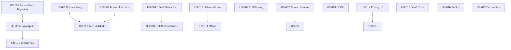

# Kizola Protect — Tarefas para Mercado US

**Data:** 2026-07-04
**Objectivo:** Preparar o projecto para lançamento no mercado dos Estados Unidos.
**Nota:** Migração para IAP (Apple/Google) está excluída deste plano — será tratada posteriormente.

---

## Como usar este ficheiro

Cada tarefa tem um ID único (`US-xxx`), prioridade, esforço estimado, e ficheiros envolvidos.
Risca-se (`~~`) quando concluída.

---

## FASE 1 — Bloqueios Legais e App Store (CRITICAL)

Tarefas que **bloqueiam** a submissão à App Store e/ou representam risco legal nos EUA.

### US-001 — Adicionar ecrã Privacy Policy
- **Prioridade:** 🔴 CRITICAL
- **Esforço:** 1 dia
- **App Store:** Guideline 5.1.1 — obrigatório
- **O que fazer:**
  - Criar ecrã `app/privacy.tsx` (ou modal reutilizável)
  - Adicionar rota no root layout
  - Link no registration (`app/register.tsx`) — já existe referência a "Privacy Policy"
  - Conteúdo em EN (fallback) + PT/FR/ES
- **Ficheiros:** `app/privacy.tsx`, `app/_layout.tsx`, `app/register.tsx`, `assets/translations/*.json`

### US-002 — Adicionar ecrã Terms of Service
- **Prioridade:** 🔴 CRITICAL
- **Esforço:** 1 dia
- **App Store:** Guideline legal — obrigatório
- **O que fazer:**
  - Criar ecrã `app/terms.tsx`
  - Adicionar rota no root layout
  - Link no registration (já existe referência a "Terms of Service")
- **Ficheiros:** `app/terms.tsx`, `app/_layout.tsx`, `app/register.tsx`

### US-003 — Migrar PII de AsyncStorage para SecureStore
- **Prioridade:** 🔴 CRITICAL
- **Esforço:** 1 dia
- **Risco:** OWASP M2 — dados sensíveis em texto plano
- **O que fazer:**
  - `lib/supabase.ts` linha 21: alterar `storage: AsyncStorage` para `storage: SecureStore` (ou adaptar com wrapper)
  - AuthProvider usa AsyncStorage para `DEMO_MODE_KEY`, `SESSION_TIMEOUT_KEY`, `LOGIN_ATTEMPTS_KEY`, `MFA_SECRET_KEY` — migrar tudo para SecureStore
  - Garantir que o Login com Apple/Google também usa SecureStore
- **Ficheiros:** `lib/supabase.ts`, `providers/AuthProvider.tsx`, `store/authStore.ts`

### US-004 — Trocar fallback i18n de PT para EN
- **Prioridade:** 🔴 CRITICAL
- **Esforço:** < 1 dia
- **Impacto:** Para mercado US, o fallback tem de ser inglês
- **O que fazer:**
  - `lib/i18n.ts` linha 50: `fallbackLng: 'pt'` → `'en'`
  - `lib/i18n.ts` linha 23 e 25: default detector também deve cair para 'en'
- **Ficheiros:** `lib/i18n.ts`

### US-005 — Adicionar Login com Apple
- **Prioridade:** 🔴 CRITICAL
- **Esforço:** 2 dias
- **App Store:** Guideline 4.8 — obrigatório se houver outros logins sociais
- **O que fazer:**
  - Instalar `expo-apple-authentication`
  - Adicionar botão "Sign in with Apple" em `app/login.tsx` e `app/register.tsx`
  - Integrar com Supabase Auth (`signInWithIdToken`)
  - Adicionar i18n para labels
- **Dependências:** `expo-apple-authentication`
- **Ficheiros:** `app/login.tsx`, `app/register.tsx`, `providers/AuthProvider.tsx`, `assets/translations/*.json`

### US-006 — Acessibilidade básica (VoiceOver/TalkBack)
- **Prioridade:** 🔴 CRITICAL
- **Esforço:** 2-3 dias
- **Risco:** ADA / WCAG 2.1 AA — risco legal nos EUA
- **O que fazer (mínimo viável):**
  - Adicionar `accessibilityLabel`, `accessibilityRole`, `accessible` nos componentes críticos:
    - Navegação (tabs, botões)
    - Formulários (inputs, submit)
    - Listas (FlatList items)
    - Modais (fechar, acções)
  - Foco especial nos ecrãs públicos: login, register, forgot-password
- **Ficheiros:** Múltiplos — `app/(app)/_layout.tsx`, `app/login.tsx`, `app/register.tsx`, `app/(app)/dashboard.tsx`, `components/auth/*.tsx`

---

## FASE 2 — Qualidade e Confiança (MAJOR)

Tarefas necessárias para um lançamento US com credibilidade.

### US-007 — Implementar testes unitários (Jest + React Native Testing Library)
- **Prioridade:** 🟠 MAJOR
- **Esforço:** 5-7 dias
- **O que fazer:**
  - Configurar Jest com preset `jest-expo`
  - Testes para: `lib/payment.ts` (lógica de validação), `hooks/useRBAC.ts`, `services/auth/phoneAuthService.ts`
  - Testes de componentes: `PhoneInput`, `OtpInput`, `KizolaLogo`
  - Smoke tests nos ecrãs principais: login, dashboard
- **Ficheiros:** Novos `**/*.test.ts`, `jest.config.js`

### US-008 — Adicionar es-US às traduções
- **Prioridade:** 🟠 MAJOR
- **Esforço:** 1 dia
- **Impacto:** Hispânicos = maior minoria linguística nos EUA
- **O que fazer:**
  - Criar `assets/translations/es-US.json` (adaptar es.json com termos US)
  - Registar no `lib/i18n.ts`
- **Ficheiros:** `assets/translations/es-US.json`, `lib/i18n.ts`

### US-009 — Implementar TLS Pinning no Axios
- **Prioridade:** 🟠 MAJOR
- **Esforço:** 1 dia
- **Risco:** OWASP M3 — MITM em Wi-Fi público
- **O que fazer:**
  - Adicionar `react-native-ssl-pinning` ou usar `axios` com `https.Agent` + certificate hash
  - Alternativa: `expo-secure-store` + `fetch` com certificado embutido
  - Aplicar em `services/api/apiClient.ts`
- **Ficheiros:** `services/api/apiClient.ts`, `package.json`

### US-010 — Adicionar Firebase Crashlytics + Analytics
- **Prioridade:** 🟠 MAJOR
- **Esforço:** 2 dias
- **Impacto:** Sem crash reporting, não sabes o que parte em produção
- **O que fazer:**
  - Instalar `@react-native-firebase/analytics` + `@react-native-firebase/crashlytics`
  - OU usar `expo` com `expo-build-properties` para configurar Firebase
  - Inicializar no root `_layout.tsx`
  - Adicionar handler global de erros não capturados
- **Ficheiros:** `app/_layout.tsx`, `app.json`, `package.json`

### US-011 — Experiência offline (NetInfo + TanStack Query persist)
- **Prioridade:** 🟠 MAJOR
- **Esforço:** 2-3 dias
- **Impacto:** App inutilizável sem internet → churn
- **O que fazer:**
  - Instalar `@react-native-community/netinfo`
  - Configurar TanStack Query `persister` com AsyncStorage para cache offline
  - Mostrar banner "You are offline" quando sem rede
  - Cache mínimo: dashboard, plans, benefits
- **Ficheiros:** `app/_layout.tsx`, `providers/OfflineProvider.tsx` (novo), `lib/queryClient.ts` (novo)

### US-012 — Adicionar universal links / deep links funcionais
- **Prioridade:** 🟠 MAJOR
- **Esforço:** 1-2 dias
- **Impacto:** Password reset, checkout redirect, onboarding
- **O que fazer:**
  - Configurar `apple-app-site-association` no servidor
  - Configurar `assetlinks.json` no servidor
  - App Links no Android (já tem package `com.kizolaprotect.app`)
  - Universal Links no iOS (já tem bundle `app.luar.6xeu64ff9auaiakubrvpo`)
  - Testar fluxo de password reset com deep link
- **Ficheiros:** `app.json`, `app/+native-intent.tsx`, backend config

### US-013 — CCPA Data Deletion flow
- **Prioridade:** 🟠 MAJOR
- **Esforço:** 2 dias
- **Risco:** California Consumer Privacy Act — obrigatório para residentes CA
- **O que fazer:**
  - Adicionar opção "Delete My Data" no profile
  - Implementar função Supabase RPC `delete_user_data(user_id)`
  - Apagar: profiles, subscriptions, documents, support_requests, auth_audit_logs
  - Enviar email de confirmação
- **Ficheiros:** `app/(app)/profile.tsx`, `supabase/functions/delete-user-data/index.ts` (novo)

---

## FASE 3 — Refinamento para Mercado US (MÉDIO)

### US-014 — Rever estratégia de pricing (preços US)
- **Prioridade:** 🟡 MÉDIO
- **Esforço:** 1 dia
- **Problema actual:** Preços em BRL com Stripe, diferença Basic/Pro é só $2
- **O que fazer:**
  - Ajustar `lib/supabase.ts` PLANS: Basic $19.99, Pro $34.99, Premium $49.99
  - Ajustar `supabase/functions/create-checkout-session/index.ts`: preços + currency para USD
  - Rever `lib/payment.ts` mock se aplicável
- **Ficheiros:** `lib/supabase.ts`, `supabase/functions/create-checkout-session/index.ts`, `lib/payment.ts`

### US-015 — Remover código morto
- **Prioridade:** 🟡 MÉDIO
- **Esforço:** < 1 dia
- **O que fazer:**
  - Apagar `app/(auth)/login.tsx.phone` — artefacto não usado
- **Ficheiros:** `app/(auth)/login.tsx.phone`

### US-016 — Adicionar Sentry para crash reporting (se não usar Firebase)
- **Prioridade:** 🟡 MÉDIO
- **Esforço:** 1 dia
- **Alternativa:** Caso Firebase não seja viável
- **O que fazer:**
  - Instalar `sentry-expo`
  - Configurar DSN no `app/_layout.tsx`
  - Adicionar `Sentry.wrap()` no root component
- **Ficheiros:** `app/_layout.tsx`, `app.json`

### US-017 — Substituir números mágicos por constantes
- **Prioridade:** 🟡 MÉDIO
- **Esforço:** 2-3 dias
- **O que fazer:**
  - Extrair cores para `constants/colors.ts`
  - Extrair tamanhos, spacing, timing para `constants/theme.ts`
  - Aplicar nos ecrãs principais (dashboard, profile, learn, support)
- **Ficheiros:** `constants/colors.ts` (novo), `constants/theme.ts` (novo), múltiplos ecrãs

---

## FASE 4 — Fiabilidade e Desempenho (PÓS-LANÇAMENTO)

### US-018 — Refactor ecrãs monolíticos (> 1000 linhas)
- **Prioridade:** 🟡 MÉDIO
- **Esforço:** 3-5 dias
- **Ecrãs a refactor:**
  - `profile.tsx` (1604 linhas)
  - `support.tsx` (1173 linhas)
  - `learn.tsx` (1161 linhas)
  - `documents.tsx` (1015 linhas)
  - `dashboard.tsx` (977 linhas)
- **Abordagem:** Extrair secções em componentes, mover lógica para hooks

### US-019 — Adicionar Login com Google
- **Prioridade:** 🟡 MÉDIO
- **Esforço:** 2 dias
- **O que fazer:**
  - Usar `expo-auth-session` + Google OAuth
  - Integrar com Supabase Auth (`signInWithIdToken`)
- **Ficheiros:** `providers/AuthProvider.tsx`, `app/login.tsx`, `app/register.tsx`

### US-020 — Performance audit
- **Prioridade:** 🟢 BAIXO
- **Esforço:** 2 dias
- **O que fazer:**
  - Analisar bundle size com `expo-analyze`
  - Verificar FlatList virtualization nos ecrãs grandes
  - Confirmar Hermes engine activo
  - Verificar memory leaks com `useEffect` cleanup
- **Ficheiros:** N/A — ferramentas de análise

### US-021 — Security hardening (jailbreak, biometria, ofuscação)
- **Prioridade:** 🟢 BAIXO
- **Esforço:** 3-4 dias
- **O que fazer:**
  - Adicionar jailbreak/root detection
  - Adicionar biometria (Face ID / Touch ID) para acesso a dados sensíveis
  - Configurar ProGuard para Android (ofuscação)
- **Ficheiros:** `providers/AuthProvider.tsx`, `app/_layout.tsx`, `android/app/proguard-rules.pro`

### US-022 — E2E tests (Detox/Maestro)
- **Prioridade:** 🟢 BAIXO
- **Esforço:** 5 dias
- **O que fazer:**
  - Configurar Maestro (mais leve que Detox para Expo)
  - Fluxos críticos: login → dashboard, register, forgot-password, OTP flow
- **Ficheiros:** `.maestro/` (nova pasta)

---

## Resumo de Esforço

| Fase | Tarefas | Esforço Total | Dependências |
|------|---------|--------------|--------------|
| **FASE 1** — Bloqueios | 6 tasks | ~9-10 dias | Nenhuma |
| **FASE 2** — Qualidade | 7 tasks | ~14-16 dias | Algumas dependem da FASE 1 |
| **FASE 3** — Refinamento | 4 tasks | ~4-5 dias | Pode começar em paralelo |
| **FASE 4** — Fiabilidade | 5 tasks | ~15-18 dias | Pós-lançamento |

**Total estimado:** ~42-49 dias de desenvolvimento.

---

## Mapa de Dependências

---

## Legenda

| Símbolo | Significado |
|---------|-------------|
| 🔴 CRITICAL | Bloqueia lançamento / risco legal |
| 🟠 MAJOR | Necessário para credibilidade no mercado US |
| 🟡 MÉDIO | Melhoria significativa de qualidade |
| 🟢 BAIXO | Pós-lançamento / nice-to-have |
